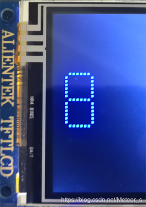

# 酷炫的数字变换
## 一、准备开发板
前段时间在网上碰巧看到一个视频（[原文链接点击这里](https://www.instructables.com/id/Morphing-Digital-Clock/)），很酷的数字变换时钟，代码还是开源的！于是我也想搞一个玩玩，淘宝搜LED显示屏，找了一圈找到一个尺寸320&#42;160mm、型号P5、分辨率也是64&#42;32的，但是卖家不提供相关资料，那我写个锤子的驱动啊。这时候拿出我封印已久的战舰板，满满的都是回忆啊！我打算用我的战舰板去移植代码，实现类似的效果。


## 二、先搞个框架
### 1.基本情况
 - LED矩阵显示屏分辨率：64&#42;32
 - LED矩阵显示屏占用区域：59&#42;15
 - 2.8寸TFT-LCD分辨率：320&#42;240

### 2.分割区域
我打算用2.8寸显示屏实现上图的效果。首先分割区域，2.8寸TFT-LCD的宽度是足够的，以长度分割320/64=5，这样像素块长度为5，整个显示屏就被分割为了 **<font color=blue>64&#42;48</font>**； 接下来在块与块之间加入间隙，由于块区域的对称性，间隙的点数必须是偶数个，对于5&#42;5的区域，间隙设置为2是最适合的，显示像素点为 **<font color=blue>3&#42;3</font>** 个，如下图所示；如果间隙设置4的话，对应显示的像素点个数为1&#42;1个，5&#42;5的区域只有一个点会亮？一家独秀是不行的。


相关宏定义如下：
```c
//64*48代表5像素点分割后的分辨率，LOC_START代表了起始位置   		
#define LOC_START_X    		3  			//0-63
#define LOC_START_Y    		16 			//0-47

#define LEN_UNIT   			(5)  	 	//像素块长宽为5
#define LEN_DIS    			(3 - 1)  	//显示像素长宽为3（0~2）
#define LEN_GAP    			(2 - 1)  	//间隙像素为2（0~1）

#define AREA_X      		59       	//框架横向最大值59
#define AREA_Y      		15       	//框架纵向最大值15
```

for循环绘制块区域的测试结果如下图：


该区域的蓝点密度为 **<font color=blue>59&#42;15</font>**，和LED矩阵用于显示的像素密度相同，达到了我想要的效果，很开心。有些东西用文字描述并没有用图表示来得直接，所以下面放张图表示一下宏定义的含义。测试代码并没有很大用处，这里就不贴了，画块区域的函数代码下面会讲。


## 三、由点到线
### 1.重定义点函数
此时的点已不是在单纯的点了，而是重新定义的<font color=blue>5&#42;5的块区域</font>，因此重定义的画块函数需要调用正点原子LCD库中提供的矩形填充函数来实现，代码如下所示：
```c
//画一个配置好的像素块
void DIGIT_DrawPixelBlock(u16 x, u16 y, u16 color)
{
	LCD_Fill((locX_now+x)*LEN_UNIT + LEN_GAP, 
		(locY_now+y)*LEN_UNIT + LEN_GAP, 
		(locX_now+x)*LEN_UNIT + LEN_GAP + LEN_DIS,
		(locY_now+y)*LEN_UNIT + LEN_GAP + LEN_DIS, color);
}
```
参数`color`表示块的颜色，为了更直观的编写和后期调试，这里的参数x和y被重定位了！蓝色显示框架的起点转换为了(0, 0)。关于这个`locY_now`，它的作用是移动显示的起点坐标。数字是多个位置显示的，函数中总要加入偏移量，此时此刻思考一下偏移量最好放在哪里，这时候有几种方法：第一种方法是把偏移量放在画块函数之中；第二种方法是在画线函数之中，将偏移量+初始位置作为实参传给画块函数；第三种方法是将偏移量+初始位置作为实参传给画线函数，这就有点扯淡了。。因为后面的动画切换会疯狂调用画线函数。第一种和第二种方法本质是相同的，但放在底层的画块函数还是好那么一丢丢。当时写的时候好像也没考虑那么多，只是感觉工程被我写得越来越复杂 T^T。


### 2.点到为止画线
画线函数很好写也很好理解，就是比较两个点的x和y坐标，判断是横线还是竖线，参数错误的情况可写可不写，这里就不多说了，一切尽在fucking source code中。
```c
//根据设置好的像素块画线
void DIGIT_DrawLine(u16 x1, u16 y1, u16 x2, u16 y2, u16 color)		//x范围0-58，y范围0-14
{
	int i;
	if (x1 == x2) {
		/*
		 * 画竖线:当y1的坐标比y2小时,填充矩形函数起始位置用(x1,y1);
		 * 当y1的坐标比y2大时,填充矩形函数起始位置用(x1,y2).
		 */
		if (y1 <= y2)
			for (i  = 0; i <=  y2 - y1; i++)
				DIGIT_DrawPixelBlock(x1, y1+i, color);
		else if (y1 > y2)
			for (i  = 0; i <=  y1 - y2; i++)
				DIGIT_DrawPixelBlock(x1, y2+i, color);
	} else if (y1 == y2) { 
		/*
		 * 画横线:当x1的坐标比x2小时,填充矩形函数起始位置用(x1,y1);
		 * 当x1的坐标比x2大时,填充矩形函数起始位置用(x2,y1).
		 */
		if (x1 <= x2)
			for (i  = 0; i <=  x2 - x1; i++)
				DIGIT_DrawPixelBlock(x1+i, y1, color);
		else if (x1 > x2)
			for (i  = 0; i <=  x1 - x2; i++)
				DIGIT_DrawPixelBlock(x2+i, y1, color);
	}
}
```

## 四、显示数字
### 1.定义数组
定义unsigned char类型数组，存储0-9的十六进制表示。十六进制转化为二进制后，各个位代表了数码管各个段的亮灭情况，1代表亮，0代表灭。
```c
const u8 digitBits[] = {
  0xFC, //B11111100, 0,  ABCDEF--
  0x60, //B01100000, 1,  -BC-----
  0xDA, //B11011010, 2,  AB-DE-G-
  0xF2, //B11110010, 3,  ABCD--G-
  0x66, //B01100110, 4,  -BC--FG-
  0xB6, //B10110110, 5,  A-CD-FG-
  0xBE, //B10111110, 6,  A-CDEFG-
  0xE0, //B11100000, 7,  ABC-----
  0xFE, //B11111110, 8,  ABCDEFG-
  0xF6, //B11110110, 9,  ABCD_FG-
};
```
### 2.数字的段
数字分为7段（点不算），seg为段号，段宽段高都设置为了6，和参考的效果一样。这里使用了宏定义，想要设置为其他的值也很方便。


```c
#define SA 		 0
#define SB 		 1
#define SC 		 2
#define SD 		 3
#define SE 		 4
#define SF 		 5
#define SG 		 6

#define SEG_WIDTH     		6        	//段宽
#define SEG_HEIGHT    		6        	//段高

void DIGIT_DrawSeg(u8 seg)
{
  switch (seg) {
	  case SA: DIGIT_DrawLine(1, 0, SEG_WIDTH, 0, segColor); break;
	  case SB: DIGIT_DrawLine(SEG_WIDTH+1, 1, SEG_WIDTH+1, SEG_HEIGHT, segColor); break;
	  case SC: DIGIT_DrawLine(SEG_WIDTH+1, SEG_HEIGHT+2, SEG_WIDTH+1, 2*SEG_HEIGHT+1, segColor); break;
	  case SD: DIGIT_DrawLine(1, 2*SEG_HEIGHT+2, SEG_WIDTH, 2*SEG_HEIGHT+2, segColor); break;
	  case SE: DIGIT_DrawLine(0, SEG_HEIGHT+2, 0, 2*SEG_HEIGHT+1, segColor); break;
	  case SF: DIGIT_DrawLine(0, 1, 0, SEG_HEIGHT, segColor); break;
	  case SG: DIGIT_DrawLine(1, SEG_HEIGHT+1, SEG_WIDTH, SEG_HEIGHT+1, segColor); break;
	  default: break;
  }
}
```

### 3.显示数字
形参为u8类型的数字，函数效果是显示该数字。
```c
//画数字
void DIGIT_DrawDigit(u8 num)  //参数范围范围0-9
{
	u8 value;
	if (num > 9)  //不在允许范围之内则退出
		return;
	value = digitBits[num];
	if (value & 0x80)	DIGIT_DrawSeg(SA);
	if (value & 0x40)	DIGIT_DrawSeg(SB);
	if (value & 0x20)	DIGIT_DrawSeg(SC);
	if (value & 0x10)	DIGIT_DrawSeg(SD);
	if (value & 0x08)	DIGIT_DrawSeg(SE);
	if (value & 0x04)	DIGIT_DrawSeg(SF);
	if (value & 0x02)	DIGIT_DrawSeg(SG);
}
```



## 五、实现动画

动画的实现靠的是循环，依次点亮指定块区域。我这里宏定义可能并不是那么好懂，手动去模拟一下就好了哈哈，一开始看到这个动画感觉好厉害呀，看了源码之后也就那么回事，但是人家就有这个创意和想法。说一下要注意的地方，动画是要考虑上一次的值的，由于变到2的情况只能是1变2，所以这里不需要去判断上一次的值；如果是变化到0，那么上一次的值可能是2、可能是3、还可能是5等，具体情况具体讨论。

```c
//动画1变到2
void DIGIT_Morph2(void) 
{
	int i;
	for (i = 0; i <= SEG_WIDTH; i++) { 
		if (i < SEG_WIDTH) {
			DIGIT_DrawPixelBlock(SEG_WIDTH - i, 0, segColor);  //画A
			DIGIT_DrawPixelBlock(SEG_WIDTH - i, SEG_HEIGHT + 1, segColor);   //画G
			DIGIT_DrawPixelBlock(SEG_WIDTH - i, 2*SEG_HEIGHT + 2, segColor); //画D		
		}
		//左平移E
		DIGIT_DrawLine(SEG_WIDTH - i + 1, SEG_HEIGHT + 2, SEG_WIDTH - i + 1, 2*SEG_HEIGHT + 1, BLACK); 
		DIGIT_DrawLine(SEG_WIDTH - i, SEG_HEIGHT + 2, SEG_WIDTH - i, 2*SEG_HEIGHT + 1, segColor);
		delay_ms(ANIM_SPEED);
	}
}
```
封装成了函数之后：
```c
/* 作用: 数字变换
 * 参数: value->当前的数字值
 *		 _value->上次的数字值
 * 返回值: none
 */
void DIGIT_Morph(u8 value, u8 _value) 
{
	switch (value) {
		case 0: DIGIT_Morph0(_value); break;
		case 1: DIGIT_Morph1(); break;
		case 2: DIGIT_Morph2(); break;
		case 3: DIGIT_Morph3(); break;
		case 4: DIGIT_Morph4(); break;
		case 5: DIGIT_Morph5(); break;
		case 6: DIGIT_Morph6(); break;
		case 7: DIGIT_Morph7(); break;
		case 8: DIGIT_Morph8(); break;
		case 9: DIGIT_Morph9(); break;
	}
}
```
## 六、为了好玩

颜色不只一种，当然显示的颜色也可以变换啦，颜色顺序太固定也没什么意思，唯有意想不到才最有趣。于是我给它加了一个随机显示颜色的功能，还可以吧。c语言提供的`void srand(unsigned int seed)`函数可以产生随机序列，但是！如果每次都提供相同的随机数种子，那么他产生的随机序列都是相同的，因此这个函数并不能达到我的要求。这时候我使用了AD采样的方式获取随机数，通过采集悬空引脚的电压值，适当处理后即可得到指定范围的随机数。

```c
void ADC1_Init(void)
{
	GPIO_InitTypeDef GPIO_InitStruct;
	ADC_InitTypeDef ADC_InitTStruct;
	
	RCC_APB2PeriphClockCmd(RCC_APB2Periph_ADC1|RCC_APB2Periph_GPIOC,ENABLE);	
	RCC_ADCCLKConfig(RCC_PCLK2_Div6);  //设置ADC分频因子6

	GPIO_InitStruct.GPIO_Mode = GPIO_Mode_AIN;
	GPIO_InitStruct.GPIO_Pin = GPIO_Pin_0;
	GPIO_InitStruct.GPIO_Speed = GPIO_Speed_50MHz;	
	GPIO_Init(GPIOC, &GPIO_InitStruct);

	ADC_InitTStruct.ADC_ContinuousConvMode = ENABLE;	//连续转换ADC_SoftwareStartConvCmd
	ADC_InitTStruct.ADC_DataAlign = ADC_DataAlign_Right; //ADC数据右对齐
	ADC_InitTStruct.ADC_ExternalTrigConv = ADC_ExternalTrigConv_None; //选择SWSATART作为触发事件
	ADC_InitTStruct.ADC_Mode = ADC_Mode_Independent;  //单次模式
	ADC_InitTStruct.ADC_NbrOfChannel = 1;	//顺序进行规则转换的ADC通道的数目
	ADC_InitTStruct.ADC_ScanConvMode = DISABLE; //设置为单通道模式
	ADC_Init(ADC1, &ADC_InitTStruct);	 
	
	ADC_RegularChannelConfig(ADC1, ADC_Channel_10, 1, ADC_SampleTime_239Cycles5);//设置指定ADC的规则组通道，转换序列，采样时间	
	ADC_Cmd(ADC1, ENABLE); 
	ADC_SoftwareStartConvCmd(ADC1, ENABLE); //使用SWSATART开始转换规则通道
	
	ADC_ResetCalibration(ADC1); //使能复位校准 
	while(ADC_GetResetCalibrationStatus(ADC1)); //等待复位校准结束
	
	ADC_StartCalibration(ADC1); //开启AD校准
	while(ADC_GetCalibrationStatus(ADC1));  //等待校准结束
	
}

//范围0-10
u16 Get_RandNum(void)
{
	u32 tem = 0;
	while(!ADC_GetFlagStatus(ADC1, ADC_FLAG_EOC)); //ADC_FLAG_EOC = 0 转换未完成
	tem = ADC_GetConversionValue(ADC1); //Returns the last ADCx conversion result data for regular channel
	return tem%10;
} 
```
## 七、上电初始化
核心的部分基本到这里都完成了，下面完善一下程序。上电之后我要显示一个给定的“时间值”，显示时分秒之间的冒号。先说明一下，我这里并没有加入DS1302之类的时钟芯片，只是单纯的显示动画，当然如果你有兴趣可以自己去加咯。
### 1.显示给定时间
上电之后的第一次显示并不需要动画，所以这里调用的是显示数字的函数，`locX_now`在上面也讲过了它的作用，给画块函数传递偏移量。`locX[0]`代表了秒的个位，`locX[1]`代表了秒的十位，以此类推。`locX[]`数组参数的值我是手动指定的，当然动态指定也是可以的咯。
```c
//记录各个数字 X 轴的起始位置
const u8 locX_start[] = {54, 45, 33, 24, 12, 3};  //秒->分->时

/*
 * 作用: 画系统起始时间
 * 参数: 时分秒，locX[]存储各个数字的起始位置
 */
void DIGIT_DrawStartTime(u8 hour, u8 minute, u8 second, u8 const locX[])
{	
	locX_now = locX[0];			 //定位
	DIGIT_DrawDigit(second%10);  //画秒的个位
	locX_now = locX[1];			 //定位
	DIGIT_DrawDigit(second/10);  //画秒的十位
	locX_now = locX[2];			 //定位
	DIGIT_DrawDigit(minute%10);  //画分的个位
	locX_now = locX[3];		 	 //定位
	DIGIT_DrawDigit(minute/10);  //画分的十位
	locX_now = locX[4];			 //定位
	DIGIT_DrawDigit(hour%10);    //画时的个位
	locX_now = locX[5];			 //定位
	DIGIT_DrawDigit(hour/10);    //画时的十位	
}
```
### 2.显示冒号
这里有3种模式可以选择，对应了不同的绘制位置，用途是在随机切换颜色时，通过绘制指定位置的冒号作为一个过渡的动画，使最终效果看起来不那么违和。
```c
/*记录四个点的左上角位置*/
const u8 locXY_dot[4][2] = {18, 4, 18, 9, 39, 4, 39, 9};

/*
 * 作用: 显示时与分，分与秒之间的冒号
 * 参数: locXY[][]: 存储冒号位置的数组
 * 		mode: 0:画两个冒号
 *   		  1:画右边的冒号
 *   		  2:画左边的冒号
 */
void DIGIT_DrawDot(u8 mode, u8 const locXY[][2])
{	
	u8 i, start, end;
	switch (mode)
	{
		case 0: start = 0; end = 4; break;
		case 1: start = 2; end = 4; break;
		case 2: start = 0; end = 2; break;
		default: break;
	}
	for (i = start; i < end; i++) {
		DIGIT_DrawPixelBlock(locXY[i][0], locXY[i][1], segColor);	
		DIGIT_DrawPixelBlock(locXY[i][0]+1, locXY[i][1], segColor);	
		DIGIT_DrawPixelBlock(locXY[i][0], locXY[i][1]+1, segColor);	
		DIGIT_DrawPixelBlock(locXY[i][0]+1, locXY[i][1]+1, segColor);			
	}	
}
```
## 八、最终的效果
颜色是随机变换的，动画还挺炫酷的吧！代码等有不足的地方还请不吝赐教。

